# Development and Testing the Profile

- [Development and Testing the Profile](#development-and-testing-the-profile)
  - [Overview](#overview)
  - [Repository Organization](#repository-organization)
    - [Branches](#branches)
      - [`main` branch](#main-branch)
      - [`v{x}r{xx}` branches](#vxrxx-branches)
    - [Releases](#releases)
    - [Tags](#tags)
      - [Current Tag](#current-tag)
      - [Major Tags](#major-tags)
      - [Patch Releases](#patch-releases)
  - [Required Software](#required-software)
  - [Required Accounts](#required-accounts)
  - [Test Suite Environment Variables](#test-suite-environment-variables)
  - [Setting Up Your Environment](#setting-up-your-environment)
    - [Prechecks](#prechecks)
  - [Running The Profile](#running-the-profile)
    - [Getting Your First Test Kitchen (TK) Run](#getting-your-first-test-kitchen-tk-run)
      - [Kitchen Stages](#kitchen-stages)
      - [Useful TK Commands](#useful-tk-commands)
      - [AWS Testing](#aws-testing)
      - [Running Through the AWS Test Suite](#running-through-the-aws-test-suite)
      - [Docker Testing](#docker-testing)
      - [Running Through the Docker Test Suite](#running-through-the-docker-test-suite)
        - [This error is just fine](#this-error-is-just-fine)
  - [Updating the Profile](#updating-the-profile)
    - [Micro vs Massive Pull Requests (PRs)](#micro-vs-massive-pull-requests-prs)
      - [Micro PRs](#micro-prs)
      - [Massive PRs](#massive-prs)
      - [PR Strategies for Different Update Scenarios](#pr-strategies-for-different-update-scenarios)
    - [Differences Between Security Benchmark Code and Traditional Software Projects](#differences-between-security-benchmark-code-and-traditional-software-projects)
    - [Workflow Patterns for `Patch Update`, `Release Update`, and `Major Version Update`](#workflow-patterns-for-patch-update-release-update-and-major-version-update)
    - [Scope of the Update Patterns](#scope-of-the-update-patterns)
    - [Guidelines for Updating Benchmark Profiles](#guidelines-for-updating-benchmark-profiles)
    - [Creating a `Patch Update`](#creating-a-patch-update)
    - [Creating a `Release Update`](#creating-a-release-update)
    - [Creating a `Major Version Update`](#creating-a-major-version-update)
  - [Test Kitchen](#test-kitchen)
    - [Test Kitchen's Modifications to Targets](#test-kitchens-modifications-to-targets)
    - [Workflow Defined by our Test Kitchen Files](#workflow-defined-by-our-test-kitchen-files)
    - [The `.kitchen/` Directory](#the-kitchen-directory)
    - [The `kitchen.yml` File](#the-kitchenyml-file)
      - [Example `kitchen.yml` file](#example-kitchenyml-file)
      - [Breakdown of the `kitchen.yml` file:](#breakdown-of-the-kitchenyml-file)
      - [Environment Variables in `kitchen.yml`](#environment-variables-in-kitchenyml)
    - [Understanding the `kitchen.ec2.yml` File](#understanding-the-kitchenec2yml-file)
      - [Example `kitchen.ec2.yml` file](#example-kitchenec2yml-file)
      - [Breakdown of the `kitchen.ec2.yml` file](#breakdown-of-the-kitchenec2yml-file)
    - [Understanding the `kitchen.container.yml`](#understanding-the-kitchencontaineryml)
      - [Example `kitchen.container.yml` file](#example-kitchencontaineryml-file)
      - [Breakdown of the `kitchen.container.yml` file:](#breakdown-of-the-kitchencontaineryml-file)
      - [Environment Variables in `kitchen.container.yml`](#environment-variables-in-kitchencontaineryml)
  - [GitHub Actions](#github-actions)
    - [`lint-profile.yml`](#lint-profileyml)
    - [`verify-ec2.yml`](#verify-ec2yml)
    - [`verify-container.yml`](#verify-containeryml)
    - [`verify-vagrant.yml.example`](#verify-vagrantymlexample)
- [InSpec Delta](#inspec-delta)
  - [Preparing the Profile Before Running Delta](#preparing-the-profile-before-running-delta)
  - [Preparing Your Environment](#preparing-your-environment)
  - [Delta Workflow Process](#delta-workflow-process)
  - [Using Delta](#using-delta)
  - [Scope of Changes by Delta](#scope-of-changes-by-delta)
    - [Further InSpec Delta Information and Background](#further-inspec-delta-information-and-background)
- [Tips, Tricks and Troubleshooting](#tips-tricks-and-troubleshooting)
  - [Test Kitchen](#test-kitchen-1)
    - [Locating Test Target Login Details](#locating-test-target-login-details)
    - [Restoring Access to a Halted or Restarted Test Target](#restoring-access-to-a-halted-or-restarted-test-target)
    - [AWS Console and EC2 Oddities](#aws-console-and-ec2-oddities)
  - [InSpec / Ruby](#inspec-ruby)
    - [Using `pry` and `pry-byebug` for Debugging Controls](#using-pry-and-pry-byebug-for-debugging-controls)
    - [Streamlining Your Testing with `inspec shell`](#streamlining-your-testing-with-inspec-shell)
    - [Using `kitchen login` for Easy Test Review and Modification](#using-kitchen-login-for-easy-test-review-and-modification)
- [Background and Definitions](#background-and-definitions)
  - [Background](#background)
    - [Evolution of STIGs and Security Benchmarks](#evolution-of-stigs-and-security-benchmarks)
  - [Definitions and Terms](#definitions-and-terms)

## Overview

This profile utilizes a variety of open-source tools including Ruby, the Test-Kitchen suite, InSpec compliance language, Ansible, Docker, and shell scripting (bash/zsh). To contribute with Pull Requests and fixes, you'll need to set up your local test suite following the instructions provided below.

Our development and testing workflow is managed by Test Kitchen. This tool is integral to our GitHub Actions CI/CD Pipelines and is also used for local development, testing, and releasing updates, patches, and full releases of the profile.

Test Kitchen uses Docker (or Podman, if preferred) and AWS (using free-tier resources) for testing. We provide example files for testing on a local Vagrant RedHat (or other RHEL variant) box in the repository.

Additionally, Test Kitchen uses the RedHat hardened `ubi8 base container` from Platform One for testing. To test the hardened container portion of the testing suite, you'll need to set up and log in to your P1 Free account, then obtain a CLI token to pull the Platform One Iron Bank RedHat Enterprise Linux 8 Universal Base Image (P1 IB UBI8) image into the test suite.

## Repository Organization

The repository and profile are organized into two primary branches: `main` and `TBD`. The repository has a set of `tags` representing iterative releases of the STIG from one Benchmark major version to the next. It will also have a set of Releases for fixes and updates to the profile between STIG Benchmark Releases.

### Branches

#### `main` branch

The `main` branch contains the most recent code for the profile. It may include bugs and is typically aligned with the latest patch release for the profile. This branch is primarily used for development and testing workflows. For production validation, use the latest stable patch release.

#### `v{x}r{xx}` branches

The `v{x}r{xx}` branches represent the changes between releases of the benchmark. They align with the STIG releases for the Benchmark found at the DISA STIG [Document Library](https://public.cyber.mil/stigs/downloads/).

### Releases

Releases use Semantic Versioning (SemVer), aligning with the STIG Benchmark versioning system of Major Version and Release. The SemVer patch number is used for updates, bug fixes, and code files between STIG Benchmark Releases for the given product. STIG Benchmarks use a Version and Release tagging pattern `v{x}r{xx}` - like V1R12 - and we will mirror that pattern in our SemVer releases.

### Tags

#### Current Tag

We don't use a specific `current` or `latest` tag. The `current`/`latest` tag for the profile and repository will always be the latest major tag of the benchmark. For example, if `v1.12.3` is the latest Benchmark release from the STIG author, then the tag `v1.12` will point to the `v1.12.3` release of the code.

To use the current `main`, point directly to the GitHub repo.

#### Major Tags

Major Tags point to the latest Patch Release of the benchmark. For example, `v1.3` and `v1.3.0` represent the first release of the Red Hat Enterprise Linux 8 STIG V1R3 Benchmark. The `v1.12.xx` tag(s) would represent the V1R12 Benchmark releases as we find bugs, fixes, or general improvements to the testing profile. This tag will point to its `v{x}r{xx}` counterpart.

#### Patch Releases

The latest Patch Release always points to the Major Release for the profile.

For example, after releasing `v1.12.0`, we will point `v1.12` to that patch release: `v1.12.0`. When an issue is found, we will fix, tag, and release `v1.12.1`. We will then 'move' the `v1.12` tag so that it points to tag `v1.12.1`. This way, your pipelines can choose if they want to pin on a specific release of the InSpec profile or always run 'current'.

## Required Software

- RVM, or another Ruby Management Tool
- Ruby v3 or higher
- Git
- VS Code or another IDE
- Docker (if you want to test hardened and non-hardened containers)
- AWS CLI
- AWS Account

## Required Accounts

1. [AWS Console Account](https://aws.amazon.com/console/ "AWS Console Account")
2. [Platform One Account](https://login.dso.mil/register "Platform One Account") (used for container testing)
3. [P1 Harbor Token](https://login.dso.mil/auth/realms/baby-yoda/protocol/openid-connect/auth?client_id=harbor&redirect_uri=https%3A%2F%2Fregistry1.dso.mil%2Fc%2Foidc%2Fcallback&response_type=code&scope=openid+profile+email+offline_access&state=WS3BsNb5JevECV4aiy3irfegFETBHfRd "DSO Harbor Login") (used for container testing)

## Test Suite Environment Variables

1. Environment Variables used by Test Kitchen

- `INSPEC_CONTROL`: Specifies which single control to run in the `bundle exec kitchen verify` phase, useful for testing and debugging a single requirement.
  - default: `none`
- `KITCHEN_LOCAL_YAML`: Specifies the target testing environment you want to use to run and validate the profile.
  - default: `none`
- `VANILLA_CONTAINER_IMAGE`: Specifies the Docker container image you consider 'not hardened' (used by `kitchen.container.yml`).
  - default: `registry.access.redhat.com/ubi8/ubi:8.9-1028`
- `HARDENED_CONTAINER_IMAGE`: Specifies the Docker container image you consider 'hardened' (used by `kitchen.container.yml`).
  - default: `registry1.dso.mil/ironbank/redhat/ubi/ubi8`

2. AWS Environment

You can either use standard AWS Profiles to configure your environment or use the standard AWS Environment variables to run the test suite. See: [AWS CLI Installation &amp; Configuration](https://docs.aws.amazon.com/cli/latest/userguide/getting-started-install.html "AWS CLI Install Guide")

- Use the `AWS_PROFILE` environment variable and AWS Credential Profiles to simplify testing on multiple AWS environments or segments. This will allow you to easily manage multiple sets of AWS Secrets and Access Keys with adjustments to a single variable. (See: docs for this)

## Setting Up Your Environment

1. Set up your Ruby Version Management system.
2. Install Ruby 3.1 or higher.
3. Configure OpenSSL, Organization Certs, etc. for your environment and tooling.
4. Set up your AWS CLI.
5. Clone the repository.
6. Obtain your [Harbor CLI Secret](https://registry1.dso.mil/harbor/projects "DSO Harbor Projects Page").
7. After logging in, click on your User Profile "About" to get the token.
8. Log in to the P1 Docker Registry.
9. Use the command `docker login -u {PI USER NAME} -p '{HARBOR CLI SECRET}' registry1.dso.mil`.
10. Run `bundle install` in your isolated Ruby environment.

### Prechecks

- Verify your newly installed Ruby environment by running `ruby --version`.
- Confirm that InSpec was installed by running `bundle exec inspec --version`.
- Check that Test Kitchen was installed by running `bundle exec kitchen version`.
- Verify that your `aws-cli` is correctly configured by running `aws s3 ls` (or your preferred test command for AWS CLI).
- Confirm your bundle installation by running `bundle exec inspec --version`.
- Verify you can pull from RepoOne by running `docker pull https://repo1.dso.mil/dsop/redhat/ubi/ubi8`.
- Celebrate 🎉️ if everything went well.

## Running The Profile

With all the necessary tools in place, you can now run the profile. First, you need to decide which testing environment you will be using. Test-Kitchen determines the testing environment through a collection of environment variables (see: Environment Variables).

The test suite offers four choices:

1. AWS VPC Testing
2. Docker Testing
3. Vagrant Testing
4. Local Testing

### Getting Your First Test Kitchen (TK) Run

For each of these examples, you need to update the `KITCHEN_LOCAL_YAML` environment variable to point to the correct `kitchen.<TEST-TARGET>.yaml` file. Ensure that any required supporting environment settings, environment variables, profiles, etc., are in place. See Environment Variables and Testing Target Environments for more information.

Learn more about the Test Kitchen project at: [kitchen.ci](https://kitchen.ci/ "Test Kichen Project Homepage")

#### Kitchen Stages

TK has four major stages: `create`, `converge`, `verify`, and `destroy`. Use these stages to create, configure, run tests, and destroy your testing target. When starting your testing, it's useful to run each of these in turn to ensure your environment, Test Kitchen, and credentials are set up and working correctly.

1. `create`:
   The `create` stage sets up your testing instance and prepares the necessary login credentials and other components so you can use your testing target.
2. `converge`:
   The `converge` stage runs the Test Kitchen suite's provisioner - the configuration management code set up in the test suite. This could be any configuration management script, such as Ansible, Chef, Puppet, Terraform, Shell, etc., that you and your team use.
3. `verify`:
   The `verify` stage runs the actual InSpec profile against your testing target. TK supports multiple testing frameworks, which are well documented on the project website.
4. `destroy`:
   The `destroy` stage tears down your test target - like an EC2 instance, Docker container, or Vagrant Box.

During your testing, you will use each of these stages to run the full profile, run individual controls (using the `INSPEC_CONTROL` environment variable), and manage your test instances. You will also use other TK commands, such as `login`, `test`, and others, which are documented on the [Test Kitchen Project](https://kitchen.ci "Test Kitchen Project Homepage") page.

You can also isolate which of the 'target suites' - either `vanilla` or `hardened` in our case - to run by appending either `hardened` or `vanilla` to the end of your TK command. For example, `bundle exec kitchen verify` will run the TK stages all the way through `verify` on _both_ the `hardened` and `vanilla` suites. However, if you say, `bundle exec kitchen verify vanilla`, it will only run it on the `vanilla` test target.

#### Useful TK Commands

- `login` : Allows you to easily log in using the TK created credentials when you ran `bundle exec kitchen create`.
- `test`: Runs all the TK stages starting with create through destroy to easily allow you to go through a full clean test run.

#### AWS Testing

1. Configure your AWS CLI and set up your AWS Credentials.
2. Test your AWS CLI access by running: `aws s3 ls`.
3. Clone the repository.
4. Navigate to the profile repository root directory.
5. Set the environment variable for the kitchen configuration file: `export KITCHEN_LOCAL_YAML=kitchen.ec2.yml`.
   1. This uses the [kitchen-ec2 driver](https://kitchen.ci/docs/drivers/aws/ "Test Kitchen AWS EC2 Driver Documentation").
6. (Optional) Set a specific control to run: export INSPEC_CONTROL='SV-230222'.

#### Running Through the AWS Test Suite

6. List the kitchen instances with: `bundle exec kitchen list`. You should see something like this:

```shell
  Instance         Driver  Provisioner      Verifier  Transport  Last Action  Last Error
  vanilla-rhel-8   Ec2     AnsiblePlaybook  Inspec    Ssh        Verified     None
  hardened-rhel-8  Ec2     AnsiblePlaybook  Inspec    Ssh        Verified     None
```

7. Create a kitchen instance: `bundle exec kitchen create vanilla`.

```shell
➜  redhat-enterprise-linux-8-stig-baseline git:(main*)bundle exec kitchen create vanilla
-----> Starting Test Kitchen (v3.5.1)
-----> Creating <vanilla-rhel-8>...
    < OTHER OUTPUT >
    Finished creating <vanilla-rhel-8> (0m0.00s).
-----> Test Kitchen is finished. (0m1.21s)
```

8. Converge the kitchen instance: `bundle exec kitchen converge`.

```shell
➜  redhat-enterprise-linux-8-stig-baseline git:(main*)bundle exec kitchen converge vanilla
-----> Starting Test Kitchen (v3.5.1)
      NOTICE - Installing needed packages
      Updating Subscription Management repositories.
      Unable to read consumer identity

      This system is not registered with an entitlement server. You can use subscription-manager to register.

      39 files removed
      < LOTS OF OTHER OUTPUT >
      Downloading files from <vanilla-rhel-8>
      Finished converging <vanilla-rhel-8> (0m21.36s).
-----> Test Kitchen is finished. (1m13.52s)
```

9. Run InSpec on the kitchen instance: `bundle exec kitchen verify`.

```shell
    ➜  redhat-enterprise-linux-8-stig-baseline git:(main*)bundle exec kitchen verify vanilla
  -----> Starting Test Kitchen (v3.5.1)
  -----> Setting up <vanilla-rhel-8>...
        Finished setting up <vanilla-rhel-8> (0m0.00s).
  -----> Verifying <vanilla-rhel-8>...
        Loaded redhat-enterprise-linux-8-stig-baseline
  Could not determine patch status.
  Profile:   redhat-enterprise-linux-8-stig-baseline (redhat-enterprise-linux-8-stig-baseline)
  Version:   1.12.0
  Target:    ssh://ec2-user@34.229.216.179:22
  Target ID: 4c62a305-69eb-5ed6-9ee7-723cdc21c578

    ✔  SV-230222: RHEL 8 vendor packaged system security patches and updates must be installed and up to date.
      ✔  List of out-of-date packages is expected to be empty
  Profile Summary: 1 successful control, 0 control failures, 0 controls skipped
  Test Summary: 1 successful, 0 failures, 0 skipped
        Finished verifying <vanilla-rhel-8> (0m5.38s).
  -----> Test Kitchen is finished. (0m6.62s)
```

10. Destroy the kitchen instance: `bundle exec kitchen destroy vanilla`.
11. For steps that apply to making updates, patches, and updates to the profile, see the next section, [Updating the Profile](#updating-the-profile).
12. Your InSpec scan results are located in the `./spec/results/` directory, nameed `./spec/results/rhel-8_*`.
13. Use [Heimdall Lite](https://heimdall-lite.mitre.org "MITRE Heimdall Lite") to load both the `hardened` and `vanilla` results to ensure your changes and updates, "failed as expected and passed as expected and covered your courner cases."

#### Docker Testing

1. Start Docker or Podman in your enviroment
2. Login to your docker registry
3. Clone the repository
4. Go into the profile repository root dir
5. `bundle install`
6. `export KITCHEN_LOCAL_YAML=kitchen.container.yml` (uses the [kitchen-dokken driver](https://kitchen.ci/docs/drivers/dokken/ "Test Kitchen Dokken Driver Documentation"))
7. `export VANILLA_CONTAINER_IMAGE=registry.access.redhat.com/ubi8/ubi:8.9-1028`
8. `export HARDENED_CONTAINER_IMAGE=registry1.dso.mil/ironbank/redhat/ubi/ubi8`
9. (optional) `export INSPEC_CONTROL='SV-230222'`

#### Running Through the Docker Test Suite

10. List the kitchen instances with: `bundle exec kitchen list`

```shell
➜  redhat-enterprise-linux-8-stig-baseline git:(main*)bundle exec kitchen list
Instance       Driver  Provisioner  Verifier  Transport  Last Action    Last Error
vanilla-ubi8   Dokken  Dummy        Inspec    Dokken     <Not Created>  <None>
hardened-ubi8  Dokken  Dummy        Inspec    Dokken     <Not Created>  <None>
```

11. Create the kitchen instance: `bundle exec kitchen create vanilla`

```shell
-----> Starting Test Kitchen (v3.5.1)
-----> Creating <vanilla-ubi8>...
      Creating kitchen sandbox at /Users/alippold/.dokken/kitchen_sandbox/de2da32d73-vanilla-ubi8
      Creating verifier sandbox at /Users/alippold/.dokken/verifier_sandbox/de2da32d73-vanilla-ubi8
      Building work image..
      Creating container de2da32d73-vanilla-ubi8
      Finished creating <vanilla-ubi8> (0m0.88s).
-----> Test Kitchen is finished. (0m1.77s)
```

12. Converge the kitchen instance: `bundle exec kitchen converge  vanilla`

```shell
➜  redhat-enterprise-linux-8-stig-baseline git:(main*)bundle exec kitchen converge vanilla
-----> Starting Test Kitchen (v3.5.1)
-----> Converging <vanilla-ubi8>...
      ...
      Finished converging <vanilla-ubi8> (0m0.00s).
-----> Test Kitchen is finished. (0m0.88s)
```

13. Run InSpec on the kitchen instance: `bundle exec kitchen verify vanilla`

```shell
-----> Starting Test Kitchen (v3.5.1)
-----> Verifying <vanilla-ubi8>...
      Loaded redhat-enterprise-linux-8-stig-baseline

Profile:   redhat-enterprise-linux-8-stig-baseline (redhat-enterprise-linux-8-stig-baseline)
Version:   1.12.0
Target:    docker://c4e89b7406dc0ebf8658fe90d6384d69885a7f07ab9bfbc91c85c64483868c44
Target ID: da39a3ee-5e6b-5b0d-b255-bfef95601890

  ×  SV-230222: RHEL 8 vendor packaged system security patches and updates must be installed and up to date. (4 failed)
...

Profile Summary: 0 successful controls, 1 control failure, 0 controls skipped
Test Summary: 0 successful, 4 failures, 0 skipped
```

##### This error is just fine

The error below is just Test Kitchen telling you that not all of the Contrls in the profile passed.

```shell
>>>>>> ------Exception-------
>>>>>> Class: Kitchen::ActionFailed
>>>>>> Message: 1 actions failed.
>>>>>>     Verify failed on instance <vanilla-ubi8>.  Please see .kitchen/logs/vanilla-ubi8.log for more details
>>>>>> ----------------------
>>>>>> Please see .kitchen/logs/kitchen.log for more details
>>>>>> Also try running `kitchen diagnose --all` for configuration
```

14. For steps that apply to making updates, patches, and updates to the profile, see the next section, [Updating the Profile](#updating-the-profile).
15. Your InSpec scan results are located in the `./spec/results/` directory, nameed `./spec/results/ubi-8_*`.
16. Use [Heimdall Lite](https://heimdall-lite.mitre.org) to load both the `hardened` and `vanilla` results to ensure your changes and updates, "failed as expected and passed as expected and covered your courner cases."

## Updating the Profile

This project follows the [GitFlow model](https://docs.github.com/en/get-started/quickstart/github-flow "GitFlow Announcement Blog") for managing the repository, accepting pull requests (PRs), and merging changes into the profile.

### Micro vs Massive Pull Requests (PRs)

In software development, the decision between making many small pull requests (micro PRs) or fewer, larger pull requests (massive PRs) often depends on the context. Both approaches have their benefits and challenges.

#### Micro PRs

Micro PRs involve making frequent, small changes to the codebase. Each PR is focused on a single task or feature.

**Benefits:**

- **Easier to review:** Small changes are easier for reviewers to understand and provide feedback on.
- **Less risk:** If a problem arises, it's easier to identify and fix because the change is isolated.
- **Faster feedback loop:** Frequent PRs mean more opportunities for feedback and improvement.

**Challenges:**

- **Overhead:** Each PR requires its own review and merge process, which can be time-consuming.
- **Context switching:** Frequent changes can disrupt the flow of work, especially if developers have to switch between different tasks.

#### Massive PRs

Massive PRs involve making larger, more comprehensive changes to the codebase. Each PR may encompass multiple tasks or features.

**Benefits:**

- **Efficiency:** Larger PRs can be more efficient because they require fewer reviews and merges.
- **Coherence:** By grouping related changes together, it may be easier to understand how different parts of the codebase interact.

**Challenges:**

- **Difficult to review:** Large changes can be overwhelming for reviewers, making it harder to catch issues.
- **Higher risk:** If a problem arises, it can be more difficult to identify and fix because it could be anywhere in the large set of changes.
- **Delayed feedback:** With fewer PRs, there are fewer opportunities for feedback.

#### PR Strategies for Different Update Scenarios

The choice between micro and massive PRs can significantly impact the workflows in our `Patch Update`, `Release Update`, and `Major Version Update`.

- **Patch and Release Updates:** These updates typically involve minor changes or additions, which can be easily managed with either micro or massive PRs. The choice depends on your team's preference for review speed and context switching.
- **Major Version or Large Jump Release Updates:** These updates require a thorough review of every single control and requirement. They also necessitate extensive testing, both automated (via the CI/CD testing matrix) and manual. In this scenario, the overhead of managing multiple micro or mini PRs can be substantial. However, the benefit is that it allows for more granitary control and review of changes. It's also easier to isolate and fix issues that arise during testing.

In conclusion, the choice between micro and massive PRs depends on the specific needs and circumstances of your project. It's important to strike a balance that maximizes efficiency while minimizing risk, and fosters effective collaboration within your team.

### Differences Between Security Benchmark Code and Traditional Software Projects

When planning your team's approach, remember that a Security Benchmark is only considered 'complete and valid' when all requirements for that specific Release or Major Version are met. This differs from traditional software projects where features and capabilities can be incrementally added.

A Security Benchmark and its corresponding InSpec Profile are only valid within the scope of a specific 'Release' of that Benchmark. Therefore, whether your team chooses a `micro` or `massive` approach is more about work style preference. The final release of the Benchmark will look the same regardless of the approach, and the expected thresholds, hardening, and validation results will ultimately determine whether it's 'ready for release'.

### Workflow Patterns for `Patch Update`, `Release Update`, and `Major Version Update`

When updating the profile, you'll be making one of three types of changes:

1. **Patch Update:** These frequent updates cover missing corner cases of testing for one or more benchmark requirements, or improvements to the InSpec code for a requirement. These updates result in a new patch release of the benchmark, such as going from `v1.12.4` to `v1.12.5`. We aim to release these updates on a regular schedule, either weekly, bi-weekly, or monthly.
2. **Release Update:** These updates occur when the STIG Benchmark owner releases an updated version of the STIG, for example, going from Red Hat Enterprise Linux V1R12 to V1R13.
3. **Major Version Update:** These updates occur when a software vendor releases a new major version of their product's STIG. For example, when RedHat releases version 9 of Red Hat Enterprise Linux or Microsoft releases a new major version of Windows, such as Windows 2024 or Windows 12.

### Scope of the Update Patterns

The STIGs and CIS Benchmarks are scoped within the Major Version of the software products they represent. Updates or amendments to a Benchmark's requirements are tracked within the 'Releases' of the Benchmark. There is no concept of 'back-patching'; it is a 'forward-only' process. Each requirement is indexed from their source SRG document, aligned to a CCI, and then given a unique `Rule ID` and `STIG ID` in the respective XCCDF Benchmark document.

Here is an example of various indices in a profile's control:

```ruby
  tag gtitle: 'SRG-OS-000480-GPOS-00227'
  tag gid: 'V-230221'
  tag rid: 'SV-230221r858734_rule'
  tag stig_id: 'RHEL-08-010000'
  tag fix_id: 'F-32865r567410_fix'
  tag cci: ['CCI-000366']
```

### Guidelines for Updating Benchmark Profiles

When updating Benchmark Profiles, adhere to these key principles to maintain alignment with the original Guidance Documents:

1. **Maintain Version Integrity:** **Never Merge** new requirements into older benchmark branches. This will create a 'mixed baseline' that doesn't align with any specific guidance document. Benchmarks, STIGs, and Guidance Documents form a 'proper subset' - they should be treated as 'all or nothing'. Mixing requirements from different versions can invalidate the concept of 'testing to a known benchmark'.
2. **Benchmarks are a Complete Set of Requirements:** A Security Benchmark is 'complete and valid' only when all requirements for a specific Release or Major Version are met. Unlike traditional software projects, features and capabilities cannot be incrementally added. A Security Benchmark and its corresponding InSpec Profile are valid only within the scope of a specific 'Release' of that Benchmark.
3. **Release Readiness Is Predefined:** A Benchmark is considered 'ready for release' when it meets the expected thresholds, hardening, and validation results. Don't be overwhelmed by the multitude of changes across the files. Instead, focus on the specific requirement you are working on. Understand its expected failure and success states on each of the target testing platforms. This approach prevents you from being overwhelmed and provides solid pivot points as you work through the implementation of the automated tests for each requirement and its 'contexts'.

By adhering to these principles, you ensure that your updates to Benchmark Profiles are consistent, accurate, and aligned with the original guidance documents.

### Creating a `Patch Update`

A patch update involves making minor changes to a profile to fix issues or improve functionality. Here's a step-by-step guide:

1. **Report the Issue:** Open an issue on our project, detailing the problem and providing examples. Do this on [our issues page](https://github.com/mitre/redhat-enterprise-linux-8-stig-baseline/issues).
2. **Fork and Branch:** Fork the repository on GitHub, then create a branch off the `tagged` patch release you're targeting for the update.
3. **Set Up Testing Suites:** In your forked branch, set up the AWS and Docker testing suites.
4. **Make Updates:** Update the control, `inspec.yml` inputs, thresholds, etc. Don't worry about the InSpec version in the `inspec.yml` - the release process handles that.
5. **Test Your Updates Locally:** Test your updates on all `vanilla` and `hardened` variants of the `known bad` and `known good` states of the `AWS EC2` and `Docker` test targets. Also, test your controls outside perfect conditions to ensure they handle non-optimal target environments. Verify that your update considers the `container`, `virtual machine`, and `1U machine` testing context of applicability.
6. **Lint Your Updates:** Use the `bundle exec rake lint` and `bundle exec rake lint:autocorrect` commands from the test suite to lint your updates.
7. **Commit Your Updates:** After testing and linting, commit your updates to your branch. Include `Fixes #ISSUE` in your commit messages to automatically close the issue when your PR is merged.
8. **Open a PR:** Open a PR on the project repository from your fork.
9. **Check Test Suite:** Ensure the GitHub Action test suite on the project side passes. You can check this at [our actions page](https://github.com/mitre/redhat-enterprise-linux-8-stig-baseline/actions).

### Creating a `Release Update`

A `Release Update` involves creating a new branch, `v#{x}R#{x+1}`, from the current main or latest patch release branch. The `saf generate delta` workflow is then run, which updates the metadata of the `controls`, `inspec.yml`, `README.md`, and other profile elements, while preserving the `describe` and `ruby code logic`. This workflow is detailed in the [Inspec Delta](#inspec-delta) section. After the initial commit of the new release branch, follow these steps to keep your work organized:

1. **Track Control IDs:** Create a table of all new `control ids` in the updated benchmark. This can be in CSV, Markdown Table, or in the PR overview information section. This helps track completed and pending work. PRs off the `v#{x}r#{x+1}` can also be linked in the table, especially if using a `micro` vs `massive` PR approach.
2. **Ensure Consistency:** Add 'check box columns' to your tracking table to ensure each requirement of the updated Benchmark receives the same level of scrutiny.
3. **Update CI/CD Process:** Update elements such as the `hardening` content (ansible, puppet, chef, hardened docker images, hardened vagrant boxes) to meet new requirements. Ensure the CI/CD process still functions with the updated elements, preferably on the PR as well.
4. **Update Labels:** Update `titles` and other labels to reflect the updated release number of the Benchmark.
5. **Commit Changes:** Commit these changes to your release branch, ensuring your CI/CD process exits cleanly.
6. **Follow Patch Update Workflow:** With the above in place, follow the 'Patch Update' process, but expect a larger number of requirements to revalidate or update.
7. **Identify Potential Code Changes:** Controls with changes to the `check text` or `fix text` are likely to require `inspec code changes`. If the `check text` and `fix text` of a control remain unchanged, it's likely only a cosmetic update, with no change in the security requirement or validation code.

### Creating a `Major Version Update`

A `Major Version Update` involves transitioning to a new STIG Benchmark, which introduces a new Rule ID index. This process is more complex than a `Release Update` due to the need for aligning old requirements (Rule IDs) with the new ones.

For example, when transitioning from RedHat Enterprise Linux 8 v1R12 to Red Hat Enterprise Linux 9 V1R1, the alignment of InSpec tests to the new requirements must be `fuzzy matched`. This involves using common identifiers such as `SRG ID`, `CCIs`, and, if necessary, the `title` and `descriptions`.

This is crucial when a single requirement from the old benchmark is split into multiple requirements in the new benchmark, although this is usually a rare occurrence.

We use a similar process in our [MITRE Vulcan](https://vulcan.mitre.org) to align 'Related Controls' in your Vulcan project to existing published STIG documents. However, the `Delta` tool currently requires manual intervention, and improvements are needed to automate this process.

The good news is that **these improvements are within reach**. We can leverage the existing work from `Vulcan` and hopefully soon incorporate these improvements into the SAF `Delta` tool as a direct function.

Once the 'old controls' and 'new controls' are aligned across 'Rule IDs', you can migrate the InSpec / Ruby code into their respective places.

Then, you follow the same setup, CI/CD organization, and control update process as in the `Release Update` process and hopfully finding that the actual InSpec code from the previous benchmark is very close to the needed InSpec code for the same 'requirement' in the new Benchmark.


## Test Kitchen

[Test Kitchen](http://kitchen.ci) is a robust tool for testing infrastructure code and software on isolated platforms. It provides a consistent, reliable environment for developing and testing infrastructure code.

### Test Kitchen's Modifications to Targets

Test Kitchen makes minor modifications to the system to facilitate initialization and access. It adds a 'private ssh key' for the default user and sets up primary access to the system for this user using the generated key. Test Kitchen uses the 'platform standard' for access - SSH for Unix/Linux systems and WinRM for Windows systems.

### Workflow Defined by our Test Kitchen Files

Test Kitchen's workflow involves building out suites and platforms using its drivers and provisioners. It follows a create, converge, verify, and destroy cycle:

1. **Create:** Test Kitchen creates an instance of the platform.
2. **Converge:** It applies the infrastructure code to the instance.
3. **Verify:** It checks if the instance is in the desired state.
4. **Destroy:** It destroys the instance after testing.

In our testing workflow, we have defined four test suites to test different deployment patterns in two configurations - `vanilla` and `hardened`.

- `vanilla`: This represents a completely stock installation of the testing target, as provided by the product vendor, with no configuration updates beyond what is 'shipped' by the vendor. Apart from the standard Test Kitchen initialization, the system is considered 'stock'.
- `hardened`: This configuration is set up using the `driver` section of the Test Kitchen suite and is executed during the `converge` phase. The `hardened` configuration represents the final `target configuration state` of our test instance, adhering to the recommended configuration of the Benchmark we are working on. For example, it aligns as closely as possible with the Red Hat Enterprise Linux V1R12 recommendations.

For more details on Test Kitchen's workflow, refer to the [official documentation](http://kitchen.ci/docs/getting-started/).

<!-- ```mermaid
journey
    title Test Kitchen Workflow
    section Setup
      Checkout  Repo: 3:  
      Install Tools: 3:
      Setup Runner: 3:
    section Configure
      Setup Vanilla Instance: 3: 
      Setup Hardened Instance: 3: 
    section Run Test Suite
      Run Tests on Vanilla: 3: 
      Run Tests on Hardened: 3: 
    section Record Results 
      Save Tests in Pipeline: 3: 
      Upload Tests to Heimdall Server: 3: 
    section Validate Aginst Threshold
      Validate the 'vanilla' threshold: 4: 
      Validate the 'hardened' threshold: 4: 
    section Pass/Fail the Run
      Threshold Met: 5: 
      Threshold Not Met: :1 
``` -->


### The `.kitchen/` Directory

The [`.kitchen/`](/.kitchen/) directory contains the state file for Test Kitchen, which is automatically generated when you first run Test Kitchen. Refer to the [Finding Your Test Target Login Details](#finding-your-test-target-login-details) section to see how you can use the `.kitchen/` directory.

### The `kitchen.yml` File

The [`kitchen.yml`](./kitchen.yml) file is the primary configuration file for Test Kitchen. It outlines the shared configuration for all your testing environments, platforms, and the testing framework to be used.

Each of the subsequent kitchen files will inherit the shared settings from this file automatlly and merge them with the setting in the child kitchen file.

#### Example `kitchen.yml` file

```yaml
---
verifier:
  name: inspec
  sudo: true
  reporter:
    - cli
    - json:spec/results/%{platform}_%{suite}.json
  inspec_tests:
    - name: RedHat 8 STIG v1r12
      path: .
  input_files:
    - kitchen.inputs.yml
  <% if ENV['INSPEC_CONTROL'] %>
  controls:
    - "<%= ENV['INSPEC_CONTROL'] %>"
  <% end %>
  load_plugins: true

suites:
  - name: vanilla
    provisioner:
      playbook: spec/ansible/roles/ansible-role-rhel-vanilla.yml
  - name: hardened
    provisioner:
      playbook: spec/ansible/roles/ansible-role-rhel-hardened.yml
```

#### Breakdown of the `kitchen.yml` file:

```yaml
verifier:
  name: inspec
  sudo: true
  reporter:
    - cli
    - json:spec/results/%{platform}_%{suite}.json
  inspec_tests:
    - name: RedHat 8 STIG v1r12
      path: .
  input_files:
    - kitchen.inputs.yml
  <% if ENV['INSPEC_CONTROL'] %>
  controls:
    - "<%= ENV['INSPEC_CONTROL'] %>"
  <% end %>
  load_plugins: true
```

This first section configures the verifier, which is the tool that checks if your system is in the desired state. Here, it's using InSpec.

- `sudo: true` means that InSpec will run with sudo privileges.
- `reporter` specifies the formats in which the test results will be reported. Here, it's set to report in the command-line interface (`cli`) and in a JSON file (`json:spec/results/%{platform}_%{suite}.json`).
- `inspec_tests` specifies the InSpec profiles to run. Here, it's running the "RedHat 8 STIG v1r12" profile located in the current directory (`path: .`).
- `input_files` specifies files that contain input variables for the InSpec profile. Here, it's using the `kitchen.inputs.yml` file.
- The `controls` section is dynamically set based on the `INSPEC_CONTROL` environment variable. If the variable is set, only the specified control will be run.
- `load_plugins: true` means that InSpec will load any available plugins.

```yaml
suites:
  - name: vanilla
    provisioner:
      playbook: spec/ansible/roles/ansible-role-rhel-vanilla.yml
  - name: hardened
    provisioner:
      playbook: spec/ansible/roles/ansible-role-rhel-hardened.yml
```

This section defines the test suites. Each suite represents a different configuration to test.

- Each suite has a `name` and a `provisioner`.
- The `provisioner` section specifies the Ansible playbook to use for the suite. Here, it's using the `ansible-role-rhel-vanilla.yml` playbook for the "vanilla" suite and the `ansible-role-rhel-hardened.yml` playbook for the "hardened" suite.

The workflow of Test Kitchen involves the following steps:

1. **Create:** Test Kitchen uses the driver (not shown in your file) to create an instance of the platform (also not shown in your file).
2. **Converge:** Test Kitchen uses the provisioner to apply the infrastructure code to the instance. In this case, it's using Ansible playbooks.
3. **Verify:** Test Kitchen uses the verifier to check if the instance is in the desired state.
4. **Destroy:** Test Kitchen uses the driver to destroy the instance after testing. This is not shown in your file.

#### Environment Variables in `kitchen.yml`

- `INSPEC_CONTROL`: This variable allows you to specify a single control to run during the `bundle exec kitchen verify` phase. This is particularly useful for testing or debugging a specific requirement.

### Understanding the `kitchen.ec2.yml` File

The `kitchen.ec2.yml` file is instrumental in setting up our testing targets within the AWS environment. It outlines the configuration details for these targets, including their VPC assignments and the specific settings for each VPC.

This file leverages the ` AWS CLI and AWS Credentials` configured as described in the previous [Required Software](#required-software) section.

Alternatively, if you've set up AWS Environment Variables, the file will use those for AWS interactions.

#### Example `kitchen.ec2.yml` file

```yaml
---
platforms:
  - name: rhel-8

driver:
  name: ec2
  metadata_options:
    http_tokens: required
    http_put_response_hop_limit: 1
    instance_metadata_tags: enabled
  instance_type: m5.large
  associate_public_ip: true
  interface: public
  skip_cost_warning: true
  privileged: true
  tags:
    CreatedBy: test-kitchen

provisioner:
  name: ansible_playbook
  hosts: all
  require_chef_for_busser: false
  require_ruby_for_busser: false
  ansible_binary_path: /usr/local/bin
  require_pip3: true
  ansible_verbose: true
  roles_path: spec/ansible/roles
  galaxy_ignore_certs: true
  requirements_path: spec/ansible/roles/requirements.yml
  ansible_extra_flags: <%= ENV['ANSIBLE_EXTRA_FLAGS'] %>

lifecycle:
  pre_converge:
    - remote: |
        echo "NOTICE - Installing needed packages"
        sudo dnf -y clean all
        sudo dnf -y install --nogpgcheck bc bind-utils redhat-lsb-core vim
        echo "updating system packages"
        sudo dnf -y update --nogpgcheck --nobest
        sudo dnf -y distro-sync
        echo "NOTICE - Updating the ec2-user to keep sudo working"
        sudo chage -d $(( $( date +%s ) / 86400 )) ec2-user
        echo "NOTICE - updating ec2-user sudo config"
        sudo chmod 600 /etc/sudoers && sudo sed -i'' "/ec2-user/d" /etc/sudoers && sudo chmod 400 /etc/sudoers

transport:
  name: ssh
  max_ssh_sessions: 2
```

#### Breakdown of the `kitchen.ec2.yml` file

```yaml
platforms:
  - name: rhel-8
```

This section defines the platforms on which your tests will run. In this case, it's Red Hat Enterprise Linux 8.

```yaml
driver:
  name: ec2
  ...
```

This section configures the driver, which is responsible for creating and managing the instances. Here, it's set to use Amazon EC2 instances. The various options configure the EC2 instances, such as instance type (`m5.large`), whether to associate a public IP address (`associate_public_ip: true`), and various metadata options.

```yaml
provisioner:
  name: ansible_playbook
  ...
```

This section configures the provisioner, which is the tool that brings your system to the desired state. Here, it's using Ansible playbooks. The various options configure how Ansible is run, such as the path to the Ansible binary (`ansible_binary_path: /usr/local/bin`), whether to require pip3 (`require_pip3: true`), and the path to the roles and requirements files.

```yaml
lifecycle:
  pre_converge:
    - remote: |
        ...
```

This section defines lifecycle hooks, which are commands that run at certain points in the Test Kitchen run. Here, it's running a series of commands before the converge phase (i.e., before applying the infrastructure code). These commands install necessary packages, update system packages, and update the `ec2-user` configuration.

```yaml
transport:
  name: ssh
  max_ssh_sessions: 2
```

This section configures the transport, which is the method Test Kitchen uses to communicate with the instance. Here, it's using SSH and allowing a maximum of 2 SSH sessions.

The workflow of Test Kitchen involves the following steps:

1. **Create:** Test Kitchen uses the driver to create an instance of the platform.
2. **Converge:** Test Kitchen uses the provisioner to apply the infrastructure code to the instance. Before this phase, it runs the commands defined in the `pre_converge` lifecycle hook.
3. **Verify:** Test Kitchen checks if the instance is in the desired state. This is not shown in your file, but it would be configured in the `verifier` section.
4. **Destroy:** Test Kitchen uses the driver to destroy the instance after testing. This is not shown in your file, but it would be configured in the `driver` section.

The `transport` is used in all these steps to communicate with the instance.

### Understanding the [`kitchen.container.yml`](./kitchen.container.yml)

The `kitchen.container.yml` file orchestrates our container-based test suite. It defines two types of containers, hardened and vanilla, and specifies the inspec_tests to run against them. It also configures the generation and storage of test reports.

Unlike other test suites, the container suite skips the 'provisioner' stage for the vanilla and hardened targets. Instead, during the create stage, it simply downloads and starts the specified images. This is due to the use of the [dummy Test Kitchen driver](https://github.com/test-kitchen/test-kitchen/blob/main/lib/kitchen/driver/dummy.rb), which is ideal for interacting with pre-configured or immutable targets like containers.

This approach allows for the evaluation of existing containers, even those created by other workflows. It can be leveraged to build a generalized workflow for validating any container against our Benchmark requirements, providing a comprehensive assessment of its security posture.

#### Example `kitchen.container.yml` file

```yaml
---
# see: https://kitchen.ci/docs/drivers/dokken/

provisioner:
  name: dummy

driver:
  name: dokken
  pull_platform_image: false

transport:
  name: dokken

platforms:
  - name: ubi8

suites:
  - name: vanilla
    driver:
      image: <%= ENV['VANILLA_CONTAINER_IMAGE'] || "registry.access.redhat.com/ubi8/ubi:8.9-1028" %>
    verifier:
      input_files:
        - container.vanilla.inputs.yml
  - name: hardened
    driver:
      image: <%= ENV['HARDENED_CONTAINER_IMAGE'] || "registry1.dso.mil/ironbank/redhat/ubi/ubi8" %>
    verifier:
      input_files:
        - container.hardened.inputs.yml
      # creds_file: './creds.json'
```

#### Breakdown of the `kitchen.container.yml` file:

```yaml
provisioner:
  name: dummy
```

This section configures the provisioner, which is the tool that brings your system to the desired state. Here, it's using a dummy provisioner, which means no provisioning will be done.

```yaml
driver:
  name: dokken
  pull_platform_image: false
```

This section configures the driver, which is responsible for creating and managing the instances. Here, it's set to use the Dokken driver, which is designed for running tests in Docker containers. The `pull_platform_image: false` option means that it won't automatically pull the Docker image for the platform; it will use the image specified in the suite.

```yaml
transport:
  name: dokken
```

This section configures the transport, which is the method Test Kitchen uses to communicate with the instance. Here, it's using the Dokken transport, which communicates with the Docker container.

```yaml
platforms:
  - name: ubi8
```

This section defines the platforms on which your tests will run. In this case, it's UBI 8 (Red Hat's Universal Base Image 8).

```yaml
suites:
  - name: vanilla
    driver:
      image: <%= ENV['VANILLA_CONTAINER_IMAGE'] || "registry.access.redhat.com/ubi8/ubi:8.9-1028" %>
    verifier:
      input_files:
        - container.vanilla.inputs.yml
  - name: hardened
    driver:
      image: <%= ENV['HARDENED_CONTAINER_IMAGE'] || "registry1.dso.mil/ironbank/redhat/ubi/ubi8" %>
    verifier:
      input_files:
        - container.hardened.inputs.yml
```

This section defines the test suites. Each suite represents a different configuration to test.

- Each suite has a `name`, a `driver`, and a `verifier`.
- The `driver` section specifies the Docker image to use for the suite. It's dynamically set based on the `VANILLA_CONTAINER_IMAGE` or `HARDENED_CONTAINER_IMAGE` environment variable, with a default value if the variable is not set.
- The `verifier` section specifies files that contain input variables for the InSpec profile.

The workflow of Test Kitchen involves the following steps:

1. **Create:** Test Kitchen uses the driver to create a Docker container of the platform.
2. **Converge:** Test Kitchen uses the provisioner to apply the infrastructure code to the container. In this case, no provisioning is done.
3. **Verify:** Test Kitchen checks if the container is in the desired state. This is not shown in your file, but it would be configured in the `verifier` section.
4. **Destroy:** Test Kitchen uses the driver to destroy the container after testing. This is not shown in your file, but it would be configured in the `driver` section.

The `transport` is used in all these steps to communicate with the container.

#### Environment Variables in `kitchen.container.yml`

The `kitchen.container.yml` file uses the following environment variables to select the containers used during its `hardened` and `vanilla` testing runs. You can test any container using these environment variables, even though standard defaults are set.

- `VANILLA_CONTAINER_IMAGE`: This variable specifies the Docker container image considered 'not hardened'.
  - default: `registry.access.redhat.com/ubi8/ubi:8.9-1028`
- `HARDENED_CONTAINER_IMAGE`: This variable specifies the Docker container image considered 'hardened'.
  - default: `registry1.dso.mil/ironbank/redhat/ubi/ubi8`

## GitHub Actions

### [`lint-profile.yml`](.github/workflows/lint-profile.yml)

This action checks out the repository, installs Ruby and InSpec, then runs `bundle exec inspec check .` to validate the structure and syntax of the InSpec profile and its Ruby code.

### [`verify-ec2.yml`](.github/workflows/verify-ec2.yml)

This action performs the following steps:

1. Checks out the repository.
2. Installs Ruby, InSpec, AWS CLI, and Test Kitchen along with its drivers.
3. Sets up the 'runner'.
4. Configures access to the AWS VPC environment.
5. Runs the `vanilla` and `hardened` test suites.
6. Displays a summary of the test suite results.
7. Saves the test suite results.
8. Uploads the results to our Heimdall Demo server.
9. Determines the success or failure of the test run based on the validation of the test suite results against the `threshold.yml` files for each test suite (`hardened` and `vanilla`).

### [`verify-container.yml`](.github/workflows/verify-container.yml)

This action performs similar steps to `verify-ec2.yml`, but with some differences:

1. It configures access to the required container registries - Platform One and Red Hat.

### [`verify-vagrant.yml.example`](.github/workflows/verify-vagrant.yml.example)

This action is similar to the `verify-ec2` workflow, but instead of using a remote AWS EC2 instance in a VPC, it uses a local Vagrant virtual machine as the test target. The user can configure whether to upload the results to our Heimdall Demo server or not by modifing the Github Action.

# InSpec Delta

## Preparing the Profile Before Running Delta

Before running Delta, it's beneficial to format the profile to match the format Delta will use. This minimizes changes to only those necessary based on the guidance update. Follow these steps:

1. **Run Cookstyle:** Install the Cookstyle gem and use it to lint the controls into Cookstyle format. Verify the gem installation with `gem list cookstyle`. Create a `.rubocop.yml` file with the provided example settings or modify these settings via the command line. Run `cookstyle -a ./controls` and any tests you have for your profile.

```shell
AllCops:
  Exclude:
    - "libraries/**/*"

Layout/LineLength:
  Max: 1000
  AllowURI: true
  IgnoreCopDirectives: true

Naming/FileName:
  Enabled: false

Metrics/BlockLength:
  Max: 400

Lint/ConstantDefinitionInBlock:
  Enabled: false

# Required for Profiles as it can introduce profile errors
Style/NumericPredicate:
  Enabled: false

Style/WordArray:
  Description: "Use %w or %W for an array of words. (https://rubystyle.guide#percent-w)"
  Enabled: false

Style/RedundantPercentQ:
  Enabled: true

Style/NestedParenthesizedCalls:
  Enabled: false

Style/TrailingCommaInHashLiteral:
  Description: "https://docs.rubocop.org/rubocop/cops_style.html#styletrailingcommainhashliteral"
  Enabled: true
  EnforcedStyleForMultiline: no_comma

Style/TrailingCommaInArrayLiteral:
  Enabled: true
  EnforcedStyleForMultiline: no_comma

Style/BlockDelimiters:
  Enabled: false

Lint/AmbiguousBlockAssociation:
  Enabled: false
```

2. **Run the SAF CLI Command:** Use `saf generate update_controls4delta` to check and update the control IDs with the provided XCCDF guidance. This process checks if the new guidance changes the control numbers and updates them if necessary. This minimizes the Delta output content and improves the visualization of the modifications provided by the Delta process.

## Preparing Your Environment

- **Download New Guidance:** Download the appropriate profile from the [DISA Document Library](https://public.cyber.mil/stigs/downloads/). Unzip the downloaded folder and identify the `<name>xccdf.xml` file.
- **Create the InSpec Profile JSON File:** Clone or download the InSpec profile locally. Run the `inspec json` command to create the InSpec Profile JSON file to be used in the `saf generate delta` command.

## Delta Workflow Process


## Using Delta

The SAF InSpec Delta workflow typically involves two phases, `preformatting` and `delta`.

Before starting, ensure you have the latest SAF-CLI, the InSpec Profile JSON file, and the updated guidance file.

1. **Preformat the Source Profile:** Before running the Delta command, preformat your source profile (usually the Patch Release profile) using the `saf generate update_controls4delta` command. This prepares the profile for the Delta process.
2. **Run the Delta Command:** Execute `saf generate delta [arguments]` to start the Delta process.

For more information on these commands, refer to the following documentation:

- [update_controls4delta](https://saf-cli.mitre.org/#delta-supporting-options)
- [saf generate delta](https://saf-cli.mitre.org/#delta)

## Scope of Changes by Delta

Delta focuses on specific modifications migrating the changes from the XCCDF Benchmark Rules to the Profiles controls, and updating the 'metadata' of each of thosin the `control ID`, `title`, `default desc`, `check text`, and `fix text`, between the XCCDF Benchmark Rules and the Profile Controls.

If the XCCDF Guidance Document introduces a new 'Rule' or `inspec control` that is not in the current profile's `controls` directory, Delta will add it to the controls directory, populating the metadata from the XCCDF Benchmark data, similar to the [xccdf-benchmark-to-inspec-stubs](https://saf-cli.mitre.org/#xccdf-benchmark-to-inspec-stub) tool.

It also adjusts the `tags` and introduces a `ref` between the `impact` and `tags`.

Delta does not modify the Ruby/InSpec code within the control, leaving it intact. Instead, it updates the 'control metadata' using the information from the supplied XCCDF guidance document. This applies to 'matched controls' between the XCCDF Guidance Document and the InSpec profile.

### Further InSpec Delta Information and Background

- The original Delta branch can be found [here](https://github.com/mitre/saf/pull/485).
- Delta moves lines not labeled with 'desc' to the bottom, between tags and InSpec code.
- Whether the controls are formatted to be 80 lines or not, Delta exhibits the same behavior with the extra text.
- Parameterizing should be considered.

# Tips, Tricks and Troubleshooting

## Test Kitchen

### Locating Test Target Login Details

Test Kitchen stores the current host details of your provisioned test targets in the `.kitchen/` directory. Here, you'll find a `yml` file containing your target's `hostname`, `ip address`, `host details`, and login credentials, which could be an `ssh pem key` or another type of credential.

```shell
.kitchen
├── .kitchen/hardened-container.yml
├── .kitchen/hardened-rhel-8.pem
├── .kitchen/hardened-rhel-8.yml
├── .kitchen/logs
├── .kitchen/vanilla-container.yml
├── .kitchen/vanilla-rhel-8.pem
├── .kitchen/vanilla-rhel-8.yml
└── .kitchen/vanilla-ubi8.yml
```

### Restoring Access to a Halted or Restarted Test Target

If your test target reboots or updates its network information, you don't need to execute bundle exec kitchen destroy. Instead, update the corresponding .kitchen/#{suite}-#{target}.yml file with the updated information. This will ensure that your kitchen login, kitchen validate, and other kitchen commands function correctly, as they'll be connecting to the correct location instead of using outdated data.

### AWS Console and EC2 Oddities

Since we're using the free-tier for our AWS testing resources instead of a dedicated host, your test targets might shut down or 'reboot in the background' if you stop interacting with them, halt them, put them in a stop state, or leave them overnight. To regain access, edit the .kitchen/#{suite}-#{target}.yml file. As mentioned above, there's no need to recreate your testing targets if you can simply point Test Kitchen to the correct IP address.

## InSpec / Ruby

### Using `pry` and `pry-byebug` for Debugging Controls

When developing InSpec controls, it's beneficial to use the `kitchen-test` suite, the `INSPEC_CONTROL` environment variable, and `pry` or `pry-byebug`. This combination allows you to quickly debug, update, and experiment with your fixes in the context of the InSpec code, without having to run the full test suite.

`pry` and `pry-byebug` are powerful tools for debugging Ruby code, including InSpec controls. Here's how you can use them:

1. First, add `require 'pry'` or `require 'pry-byebug'` at the top of your control file.
2. Then, insert `binding.pry` at the point in your code where you want to start debugging.
3. When you run your tests, execution will stop at the `binding.pry` line, and you can inspect variables, step through the code, and more.

***!Pro Tip!***

- Remember to remove or comment out the `binding.pry` lines when you're done debugging or you won't have a good 'linting' down the road.

### Streamlining Your Testing with `inspec shell`

The `inspec shell` command allows you to test your full control update on your test target directly. To do this, you'll need to retrieve the IP address and SSH PEM key for your target instance from the Test Kitchen `.kitchen` directory. For more details on this, refer to the [Finding Your Test Target Login Details](#finding-your-test-target-login-details) section.

Once you have your IP address and SSH PEM key (for AWS target instances), or the container ID (for Docker test instances), you can use the following commands:

- For AWS test targets: `bundle exec inspec shell -i #{pem-key} -t ssh://ec2-user@#{ipaddress} --sudo`
- For Docker test instances: `bundle exec inspec shell -t docker://#{container-id}`

### Using `kitchen login` for Easy Test Review and Modification

The `kitchen login` command provides an easy way to review and modify your test target. This tool is particularly useful for introducing test cases, exploring corner cases, and validating both positive and negative test scenarios.

# Background and Definitions

## Background

### Evolution of STIGs and Security Benchmarks

The Department of Defense (DOD) has continually updated its databases that track rules and Security Technical Implementation Guides (STIGs) that house those rules.

Initially, the system was known as the Vulnerability Management System (VMS).

In the STIGs, you might come across data elements that are remnants from these iterations. These include `Group Title` (gid or gtitle), `Vulnerability ID` (VulnID), `Rule ID` (rule_id), `STIG ID` (stig_id), and others.

A significant change was the shift from using `STIG ID` to `Rule ID` in many security scanning tools. This change occurred because the Vulnerability Management System used the STIG_ID as the primary index for the requirements in each Benchmark in VMS.

However, when DISA updated the Vendor STIG Processes and replaced the VMS, they decided to migrate the primary ID from the STIG ID to the Rule ID, tracking changes in the Rules as described above.

Examples of tools that still use either fully or in part the 'STIG ID' vs the 'Rule ID' as a primary index are: the DISA STIG Viewer, Nessus Audit Scans, and Open SCAP client.

While these elements might seem confusing, understanding their historical context is essential.

In our modern profiles, some data from the XCCDF Benchmarks still exist in the document but are not used or rendered in the modern InSpec Profiles. However, in some of the older profiles, you may see many of these data elements as `tags` in the profile. The intention was to ensure easy and lossless conversion between XCCDF Benchmark and HDF Profile.

It was later realized that since the structure of these data elements was 'static', they could be easily reintroduced when converting back to an XCCDF Benchmark. Therefore, rendering them in the profile was deemed unnecessary.

## Definitions and Terms

- **Baseline**: This refers to a set of relevant security controls, such as NIST 800-53 controls or Center for Internet Security Controls. These controls offer high-level security best practices, grouped into common areas of concern.
- **Benchmark**: This is a set of security controls tailored to a specific type of application or product. These controls are typically categorized into 'high', 'medium', and 'low' levels based on Confidentiality, Integrity, and Availability (C.I.A).
- **Security Technical Implementation Guide (STIG)**: This is a set of specific technical actions required to establish a certain security posture for a software product. It is based on a desired Security Requirements Guide that applies to the product's software class and function, such as operating system, web server, database, etc. You can find an archive of these at the DISA STIG [Document Library](https://public.cyber.mil/stigs/downloads/).
- **Profile**: This is a set of tests representing a STIG or a CIS Benchmark. These tests automate the validation of a system against that STIG or CIS Benchmark.
- **Patch Update**: These are regular updates that address missing corner cases of testing for one or more benchmark requirements, or improvements to the InSpec code for a requirement. These updates result in a new patch release of the benchmark, e.g., `v1.12.4` to `v1.12.5`.
- **Release Update**: These are updates that occur when the STIG Benchmark owner releases an updated version of the STIG, e.g., Red Hat Enterprise Linux V1R12 to V1R13.
- **Major Version Update**: These are updates that occur when a software vendor releases a new major version of their product's STIG, e.g., RedHat releasing version 9 of Red Hat Enterprise Linux or Microsoft releasing a new major version of Windows.
- **XCCDF Benchmark (XCCDF or XCCDF Benchmark)**: XCCDF (Extensible Configuration Checklist Description Format) is a standard developed by NIST and DOD to provide a machine-readable XML format for creating security guidance documents and security technical implementation guides. You can find an archive of these at the DISA STIG [Document Library](https://public.cyber.mil/stigs/downloads/).
- **Security Requirements Guide (SRG)**: SRG documents provide generalized security guidance in XCCDF format that applies to a 'class' of software products such as 'web server', 'operating systems', 'application servers' or 'databases'. You can find an archive of these at the DISA STIG [Document Library](https://public.cyber.mil/stigs/downloads/).
- **SRG_ID**: This is the unique identifier of the SRG requirement. These indexes, like the STIG Rule IDs, also show their parent-child relationship. For example: 'SRG-OS-000480-GPOS-00227'.
- **[Common Correlation Identifier](https://public.cyber.mil/stigs/cci/) (CCI)**: The Control Correlation Identifier (CCI) provides a standard identifier and description for each of the singular, actionable statements that comprise an IA control or IA best practice. For example: 'CCI-000366'.
- **Rule ID (rid)**: The Rule ID has two parts separated by the `r` in the string - ('SV-230221) and (r858734_rule)'. The first part remains unique within the major version of a Benchmark document, while the latter part of the string is updated each time the 'Rule' is updated 'release to release' of the Benchmark. For example: 'SV-230221r858734_rule'.
- **STIG ID (stig_id)**: Many testing tools and testing results tools use this ID - vs the Rule ID - to display each of the individual results of a Benchmark validation run. For example: 'RHEL-08-010000'. Examples include: DISA STIG Viewer, Nessus Audit Scans and the Open SCAP client.
- **Group Title (gtitle)**: This is essentially the SRG ID but is a holdover data value from the old Vulnerability Management System. For example:  'SRG-OS-000480-GPOS-00227'.
